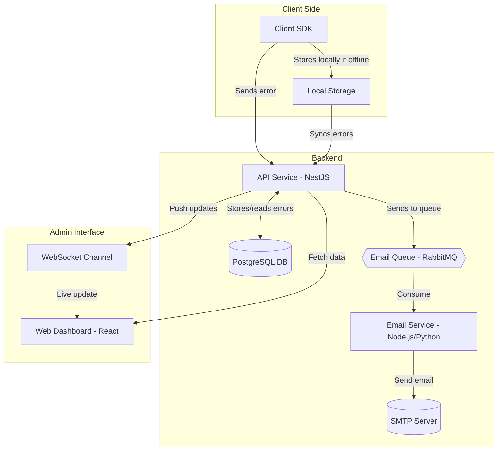

# Error logging service architecture

Based on the functional requirements I would make a service consisting of the following parts:

- Client SDK
- API service
- API database
- Email queue
- Email service
- Web dashboard

### Client SDK

The client SDK depending on the language and technologies used on client receives all errors occurring in the app. If the client can work offline, we would also store all the errors locally when offline and send them to the API service once the client is back online.

### API service

The API service receives the errors from the client and processes them. Depending on the error criticality it may post a record with a notification letter to the email queue. The email service takes the records from the queue and sends the emails. The API service service saves the info about the error to the API database so it can later send it to the Web dashboard.
I'd use Nest.js for the API service due to it's well-established modular architecture, diverse ecosystem and active community.

### Email service and queue

The email queue may be based on RabbitMQ or any other message broker. The email service service can be a simple message broker listener, written on Node.js or Python that takes the records from the queue and send them to the external SMTP server if it's available.

### API database

As the API database I'd use PostgresSQL since its almost an industry standard. It is fast, robust and although it is a relational database it can store variable shape data in JSONB columns, which is quite important for us since the errors sent from client might not have a static structure.

### Web dashboard

For the Web dashboard I'd use regular React. I don't think we care about SEO here, because it wll not be public, so we don't need technologies such as Gatsby or Next.js. Alternatively other frontend-frameworks can be used, such as Vue, Svelte or Angular. I'd prefer React since it's the most straightforward.
We may want to make the dashboard get updated automatically. We can use a websocket connection between the web dashboard and the API service, in which the API service will post a message whenever the dashboard needs to be updated.

### DevOps

The error logging service will be deployed on Kubernetes to ensure scalability and reliability. Each component — API service, email service — will run inside Docker containers managed by Kubernetes, which will handle deployments, scaling, and failover automatically. The web dashboard will be published to a CDN. A CI/CD pipeline will automate building, testing, and deploying new versions. Configuration and secrets will be securely managed through Kubernetes mechanisms. For the message queue and database, managed cloud services are preferred, but self-hosted options can be deployed as stateful sets within Kubernetes if necessary.

### Security

#### Secure Communication

All data transmitted between the client, API service, dashboard, and email service will be encrypted using TLS (HTTPS) to prevent eavesdropping and tampering.

#### Authentication and Authorization

Clients (SDKs) will authenticate using API keys or tokens.

The admin dashboard will require secure user authentication and optionally role-based access control to restrict access to sensitive data and features.

#### Input Validation and Protection

Incoming data will be validated and sanitized to protect the system against malicious input, including injection attacks and malformed payloads.

#### Rate Limiting and Abuse Protection

To prevent system overload or abuse (e.g., infinite error loops), API usage will be rate-limited per client and monitored for anomalies.

### Architecture diagram

## Questions for platform owner

- What is the tech stack of the client?
- Can client work offline?
- How advanced the wab dashboard should be? Authentication methods? Does it need roles access roles system?
- Does the service need to automatically create issues in Jira, Clickup, etc?
- Are there any particular requirements for the indicators on the dashboard?
- How many daily active users does the platform have?
- Does the dashboard has to get updated automatically?
